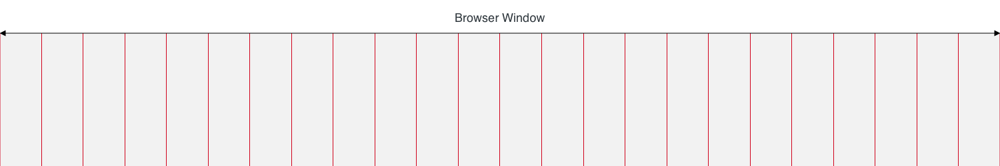
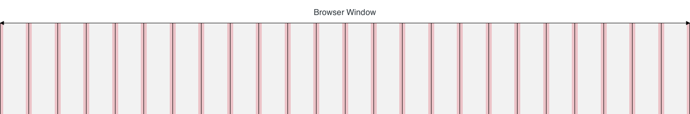
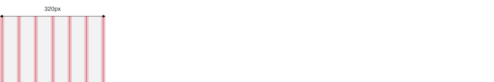
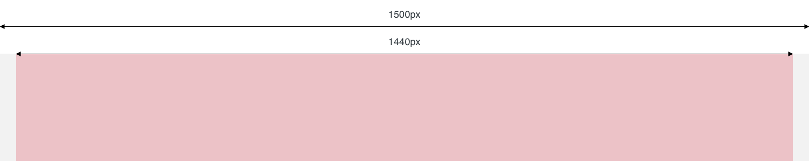
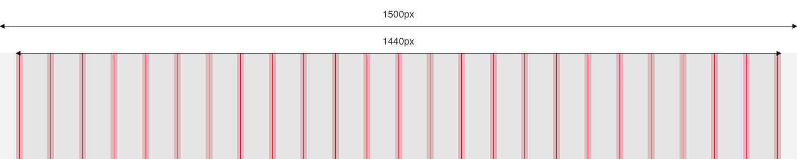
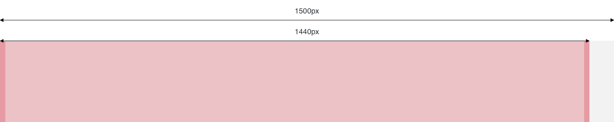

# Gitter
## Plugin for Tailwind CSS

This Tailwind CSS plugin adds additional utility classes for a fluid response grid system to facilitate the **positioning** and **alignment** of content and design elements.
The number of columns can be configured for each breakpoint, respectively.

In contrary to common grid systems like the *Bootstrap* grid, *Gitter* cols have a fixed width according to the screen size  and are independent of the width of their parent element.

### Installation

*Gitter* is part of the npm registry and can be installed using *npm* or *yarn*:

```
npm install tailwindcss-gitter
```
or
```
yarn add tailwindcss-gitter
```

Then you can require the plugin in your Tailwind config:

```
plugins: [
  require('tailwindcss-gitter')
]
```

### Introduction
*Gitter* divides the available space of the screen into a predefined number of columns of equal width:


Each column has a defined left and right padding. This padding is referred to as *gutter*:


This *gutter* ensures, that there is a gab between the contents of two adjacent columns:


Additionally, there is an extra padding before the first and after the last column, to ensure, that all content on the page has at least one *gutter* width of distance to the edges of the screen (or browser window):


The *gutter* can be handled with Tailwind CSSs default utility classes for horizontal padding. The extra padding outside of the section can be configured in the gitter tailwind settings (`outerGutter`).

The number of columns can vary between different projects. However, it can also differ between screen sizes. For example a display with a width of 320 pixels could have six columns:


while from a width of 800 pixels, the number of columns could be twelve:


The previous illustrations would indicate, that the grid always spans across 100% of the available space and fill out the whole viewport. This assumption is true, up to a certain point. For large screens, there is often need for a maximum width for the content area, which is typically centered on the screen. The default value for the maximum content width is 1440 pixels:


In this case the grid is supposed to be used inside this area. The default number of columns for screens is 24:


### Usage

#### Section Utility
Many layouts will have a maximum content width, where the content area has a width of 100% (minus the outer gutter) on smaller devices and a fixed with of e.g. 1440px for screens bigger than that. This is the exact use case of a *Section*. A *Section* is created by using the `section` utility class on an html-element. The element will than have the max-width defined for the project or a width of 100%, if the viewport is smaller than the defined max-width.
If the section should have a padding is up to you to define using Tailwinds padding utilities.


By default a *Section* is not centered. To get a centered *Section*, just use the Tailwind CSS default utility `mx-auto`:


#### Column Utilities

### Settings
*Gitter* offers various configurations to adapt to the needs of different projects:


